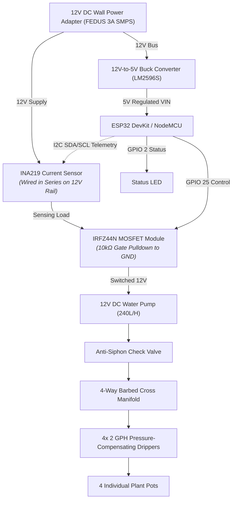
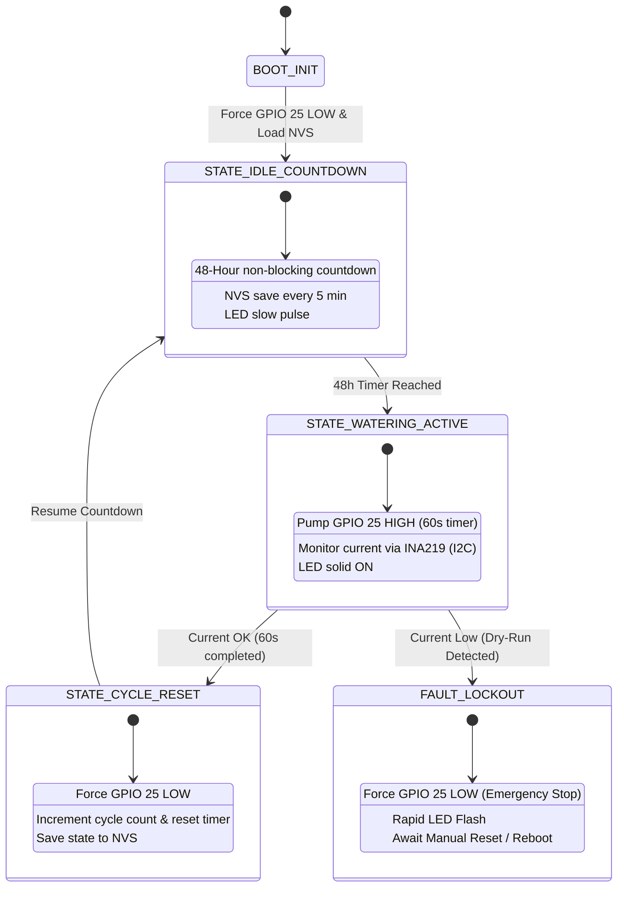

# Comprehensive Engineering Design Document & Functional Specification (v2.0)
* **Project Name:** Automated Plant Watering System (v2.0)
* **Target Scale:** 4 Plant Pots (Equal Distribution via 2 GPH Drippers)
* **Core Microcontroller:** ESP32 NodeMCU / DevKit
* **Power Supply:** 12V DC Wall Power Adapter (Mains-Powered)
* **Status:** Finalized Architecture & Design Specification

---

## 1. Executive Summary & Project Scope

### 1.1 Purpose
This document outlines the complete architectural, electrical, mechanical, and software design for an automated plant watering system powered by a 12V DC wall adapter. Designed for reliable operation while traveling, it operates on a strict time-based schedule (watering every alternate day) using a water bucket reservoir.

To eliminate real-world field failure points (such as motor dry-burns, accidental siphoning, and power outage disruptions), this architecture integrates robust hardware safety buffers, non-volatile memory (NVS) state persistence, precise hydraulic balancing, and local feedback mechanisms without relying on complex, fragile soil moisture sensors.

### 1.2 Scope
* Time-based automated irrigation running on a fixed 48-hour alternate-day cycle.
* Mains-powered via 12V DC wall power adapter for 100% uptime reliability.
* NVS memory persistence to survive household power flickers/outages without missing or duplicating watering cycles.
* Hardware-level failure mitigations including dry-run protection, anti-siphon flow control, and GPIO pulldown resistors.
* Local feedback via status LEDs, USB serial logging, and optional development-only Wi-Fi web dashboard (compiled out for production).

---

## 2. Complete Bill of Materials (BOM) & Component Justification

| Category | Component Item | Specification / Model & SKU | Engineering Justification |
| :--- | :--- | :--- | :--- |
| **Control** | Microcontroller | ESP-WROOM-32D ESP32 NodeMCU (SKU: PRO2049) | Low-power capabilities, NVS flash memory for state persistence, robust hardware timers, built-in Wi-Fi for development debugging. |
| **Power Supply** | Wall Power Adapter | FEDUS 12V 3A SMPS Adapter (Table Top) | Primary power input; directly energizes 12V pump bus and step-down buck converter. |
| **Power Connectors** | DC Power Connectors | 5mm DC Jack Socket/Male Pairs, Panel Mounts (SKU: R261229, 699534, 44425) | Secure power distribution and disconnections between enclosure and adapter. |
| **Regulation** | DC-DC Step-Down | LM2596S DC-DC Buck Converter (SKU: 11548) | Steps down 12V input to regulated 5V to safely power the ESP32 logic. |
| **Actuation** | Water Pump | Ultra-Quiet DC 12V 240L/H Brushless Submersible Pump (SKU: 815882) | Provides reliable water flow from the bucket reservoir. |
| **Switching** | Logic-Level MOSFET | IRFZ44N MOSFET IC Dip-3 Pin (SKU: 1869827) | Fully saturates at logic level for reliable pump switching. |
| **Safety** | Gate Pulldown | Yageo 10kΩ Metal Film Resistor (SKU: R227457) | Ensures GPIO 25 remains strictly LOW during ESP32 bootloader phase. |
| **Safety** | Dry-Run Sensor | INA219 I2C Current & Power Monitor (SKU: 421237) | Monitors pump motor electrical load via I2C for dry-run detection. |
| **Safety** | Anti-Siphon Valve | CentIoT 4mm One-Way Non-Return Check Valve | Prevents gravity-fed siphoning/draining of the bucket when pump is idle. |
| **Enclosure** | Weatherproof Box | 100x68x50mm Transparent IP65 ABS Junction Box (SKU: R260518) | Protects electronics, wiring, and ESP32 from moisture and dust. |
| **Interfacing** | Switches & LEDs | Rocker Switch (1265378), Toggle Switches, Push Buttons, 10mm Red/Green LEDs (827894, 827892) | Manual controls, power switching, and visual status indication. |
| **Prototyping** | Wires & Boards | MB102 Breadboard, 2x8/7x9cm PCB Boards, 26AWG Teflon Wires (Red/Black) | Circuit wiring, prototyping, and internal connections. |
| **Hydraulics** | Emitters & Tubing | 4x Pressure-Compensating Drippers (2 GPH) + 4mm Tubing | Guarantees exact, equal water distribution across plant pots. |

---

## 3. End-to-End System Architecture & Wiring Schematic

### GPIO & Interface Assignment & Hardware Safety Rules
* **Pump Control:** GPIO 25 (Digital Output). An external 10kΩ pulldown resistor to GND ensures GPIO 25 stays strictly LOW during ESP32 power-on / bootloader execution.
* **Current Monitoring (INA219):** I2C Bus (SDA / SCL, default GPIO 21 / 22). Monitors pump motor electrical current for dry-run detection.
* **Status LED:** GPIO 2 (Digital Output). Visual system state feedback.
* Strapping pins (GPIO 0, 2, 12, 15) are avoided for pump control to prevent accidental triggers during boot.

---

## 4. Functional Requirements

### 4.1 Power Subsystem Requirements
* **FR-P1:** The system shall draw primary energy from a 12V DC wall power adapter (2A–3A rating).
* **FR-P2:** A 12V-to-5V step-down buck converter (LM2596) shall supply regulated power to the ESP32 logic board.
* **FR-P3:** The 12V power bus shall directly supply the DC water pump via the MOSFET switching module.

### 4.2 Control & Computation Requirements
* **FR-C1:** The ESP32 shall maintain an internal non-blocking countdown timer corresponding to a 48-hour watering interval.
* **FR-C2 (NVS State Persistence):** Every 5 minutes during countdown, the ESP32 shall write the remaining countdown time and total watering cycle count to Non-Volatile Storage (NVS / Preferences API). Upon reboot or power restoration, the countdown shall resume from the last saved state.
* **FR-C3:** The system shall provide visual feedback via status LEDs (slow blink for idle countdown, solid ON during active pumping, rapid flash for error/fault conditions).
* **FR-C4 (Debug Web Server):** A local HTTP web server for system telemetry and manual pump overrides shall be available only during development, controlled by the `#define DEBUG_WEB_SERVER` compile flag. In production builds, the Wi-Fi stack is disabled for maximum stability.

### 4.3 Actuation & Hydraulics Requirements
* **FR-H1:** The system shall utilize a 12V mini DC water pump switched via an IRLZ44N logic-level MOSFET module (or 3.3V optoisolated relay) controlled by digital GPIO 25 from the ESP32. A 10kΩ external pulldown resistor shall be installed on the MOSFET gate line.
* **FR-H2 (Hydraulic Calibration):** A single watering cycle shall run for a calibrated duration of **60 seconds**, delivering approximately **500ml** total water volume (~125ml per pot). Based on 4x 2 GPH pressure-compensating drippers: total flow = 8 GPH ≈ 504 ml/minute ≈ 8.4 ml/second; 60s × 8.4 ml/s ≈ 504 ml.
* **FR-H3:** Water shall pass through an inline anti-siphon check valve into a 4-way barbed cross manifold, terminating in 4 individual **2 GPH pressure-compensating drippers** to ensure balanced fluid distribution.

### 4.4 Safety & Fault Mitigation Requirements
* **FR-S1 (Dry-Run Protection):** An INA219 current sensor module wired in series with the 12V pump circuit shall monitor motor operating current via I2C. If current drops below the dry-run threshold during active pumping, the ESP32 shall abort the watering cycle, lock out the pump, force GPIO 25 LOW, and signal a fault via rapid LED flash.
* **FR-S2 (Back-Siphon Prevention):** An anti-siphon check valve shall prevent passive gravity drainage of the bucket when the pump is idle.
* **FR-S3 (Watchdog / Boot Safety):** Upon any unexpected system reset or boot cycle, the ESP32 initialization sequence shall immediately force GPIO 25 to LOW (OFF) before any other operations. The external 10kΩ pulldown resistor provides redundant hardware-level protection.

---

## 5. Operational State Machine

