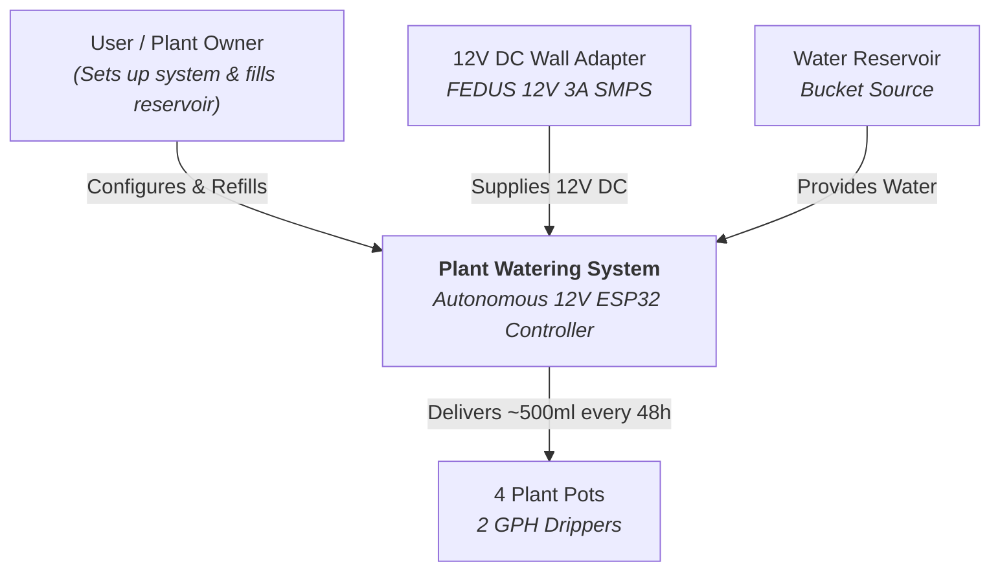

# C1: System Context - Automated Plant Watering System

## Overview
The C1 System Context diagram outlines the highest-level view of the Plant Watering System, showing its interaction with external entities (Users, Water Bucket Reservoir, Plant Pots, and Mains Power).

## Boundaries & Relationships
- **User:** Interacts during setup and occasional reservoir refills.
- **Power Source:** Mains-powered 12V 3A adapter ensuring 100% uptime reliability.
- **Water Reservoir:** Static bucket source equipped with low-level monitoring or visual checks.
- **Plant Pots:** 4 target plants irrigated equally via pressure-compensating drippers and check valves.
