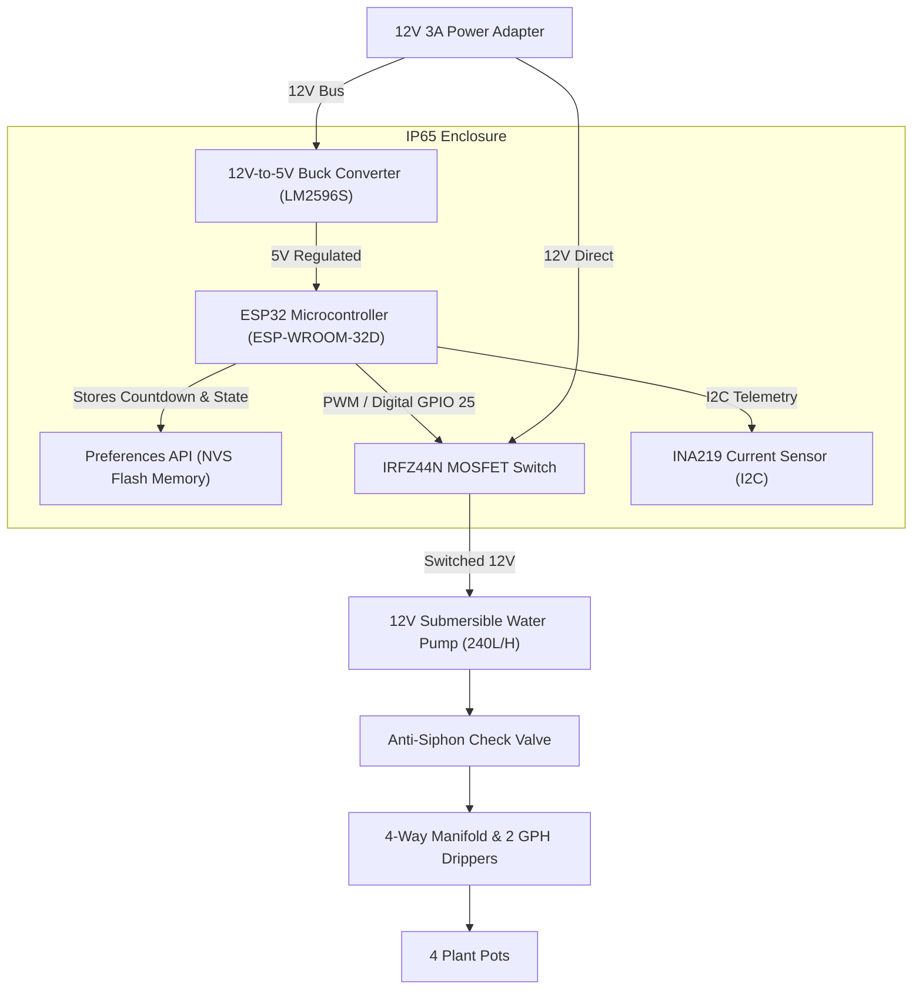

# C2: Container Architecture - Automated Plant Watering System

## Overview
The C2 Container diagram breaks down the system into high-level runtime containers, illustrating the ESP32 firmware application, onboard NVS storage, and electrical hardware subsystems.

## Containers
1. **ESP32 Firmware:** Runs the core non-blocking countdown timer, pump control logic, and safety monitors.
2. **NVS Flash Storage:** Persists countdown timer state every 5 minutes to survive power outages.
3. **Hardware Actuators & Sensors:** 12V pump, IRLZ44N MOSFET switch, INA219 current sensor, and buck converter.
