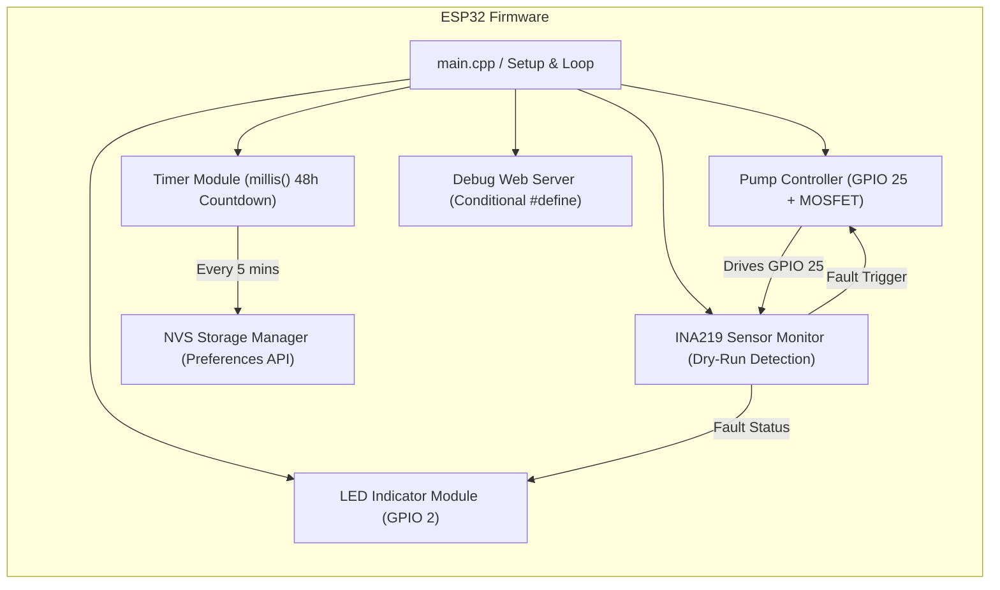

# C3: Component Architecture - ESP32 Firmware Modules

## Overview
The C3 Component diagram details the internal software modules inside the ESP32 firmware application.

## Component Descriptions
- **Timer Module:** Non-blocking 48-hour countdown timer using `millis()`.
- **NVS Storage Manager:** Saves countdown state to ESP32 flash memory every 5 minutes.
- **Pump Controller:** Manages GPIO 25 output with hardware 10k pull-down protection.
- **Sensor Monitor:** Polls the INA219 current sensor over I2C to detect dry-running.
- **LED Feedback:** Provides visual status indication via GPIO 2 LED.
- **Debug Web Server:** Optional local web dashboard compiled only when `DEBUG_WEB_SERVER` is defined.
